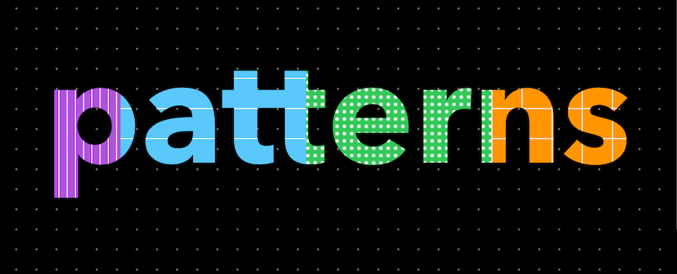
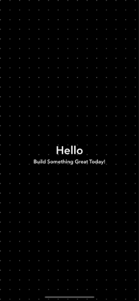

Patterns is an easy to use, pure-Swift library for drawing patterns so that you don't have to ship iOS apps with blank backgrounds. 

To ease the usage with interface builders, all of the patterns are made `@IBDesignables`, set the properties directly from the interface builder, set some constraints to the view and you are ready to go.


## Usage

The simplest use-case is using a pattern as background for your views. 




```

import Patterns

let dotView = DotView()
dotView.dotColor = .white
dotView.dotSize = 2.0
dotView.spacing = 20
dotView.backgroundColor = .black
self.view.addSubview(dotView)
dotView.pinTo(self.view, insets: .zero)

```

Combining patterns and masking text and other shapes.


```

import Patterns

let dotView = DotView()
dotView.dotColor = .white
dotView.dotSize = 2.0
dotView.spacing = 20
dotView.backgroundColor = .black
self.view.addSubview(dotView)
dotView.pinTo(self.view, insets: .zero)

let checksView = ChecksView(frame: CGRect(x: 50, y: 50, width: 300, height: 300))
checksView.lineColor = .white
checksView.backgroundColor = .cyan
checksView.size = 20
dotView.addSubview(checksView)

let label = UILabel(frame: CGRect(x: 0, y: 0, width: 300, height: 300))
label.text = "Hello"
label.font = UIFont.systemFont(ofSize: 80)
checksView.mask = label

```

## Available Patterns

- Dots
- Lines
- Stripes
- Checks

You can check all the available patterns in the demo app provided with this repo.

## Installation

### Swift Package Manager

From Xcode 11, you can use [Swift Package Manager](https://swift.org/package-manager/) to add Patterns to your project.

1. Select File > Swift Packages > Add Package Dependency. Enter `https://github.com/vinayjn/Patterns.git` in the "Choose Package Repository" dialog.
2. In the next page, specify the version resolving rule as "Up to Next Major" with "0.0.1" as its earliest version.
3. After Xcode checking out the source and resolving the version, you can choose the "Patterns" library and add it to your app target.

If you encounter any problem or have a question on adding the package to an Xcode project, I suggest reading the [Adding Package Dependencies to Your App](https://developer.apple.com/documentation/xcode/adding_package_dependencies_to_your_app) guide article from Apple.


## TODOs

- [ ] Cocoapods and Carthage support
- [ ] Diagonal drawing(lines and stripes)
- [ ] Animations
- [ ] Documentation
- [ ] macOS support


## Contributions

There are a lot of features pending to be implemented in this library, please head over to the [Issues Tab](https://github.com/vinayjn/Patterns/issues), find a feature/issue you would like to see in this library and raise a pull request.

I've tried to optimize the pattern drawing as per my knowledge and I would really appreciate if you can help me optimize it more.
